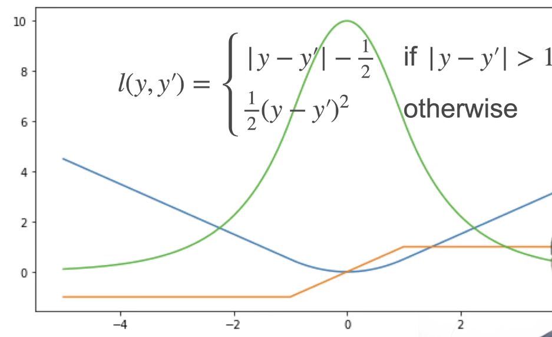

### Logistic Regression

逻辑回归，二分类问题

### Softmax Regression

实际是分类问题

对逻辑回归算法在多分类问题上的推广

### Huber's Robust Loss

huber鲁棒损失

### softlabel

### 数据集

不要把验证数据集当作训练数据集来用

不要把测试数据集当作验证数据集来用

### K-fold交叉验证

非大数据集上使用

### 模型容量（模型复杂度）

拟合各种函数的能力

模型容量要匹配数据复杂度，否则可能导致欠拟合或过拟合